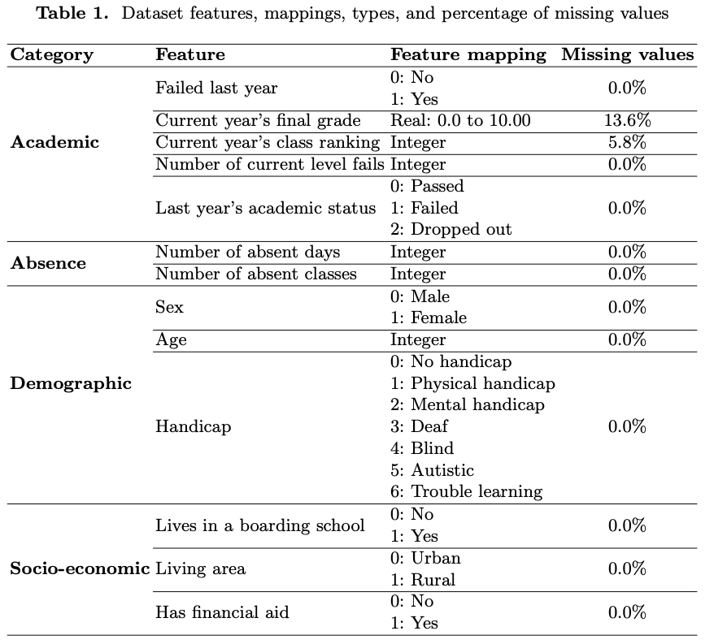

# Investigating the Predictive Potential of Large Language Models in Student Dropout Prediction
## Full architecture:
As discussed in our paper, our method relies on Few-Shot Learning, a subset of Machine Learning utilized for tasks like classification and entity recognition in scenarios of data scarcity and transfer learning. FSL trains learners on a small, yet representative dataset, aiming for robust performance. Our approach operates as follows:
- Student data, aimed at predicting dropout likelihood, undergoes vectorization and mapping via the Student Record Processor, treating the student as a "query".
  
- The Similarity Retriever selects examples, or "shots," from pre-vectorized learning data based on the vectorized query data.

- The retrieved shots and query data are then processed by the Student Record Processor and sent to the Prompt Generator.
  
- The Prompt Generator generates prompts using a pre-specified template, which are then fed to the LLMs to generate responses.

The full architecture is illustrated in the figure bellow:

## Details about the Architecture
- [Student Record Processor](#student-record-processor)
- [Similarity Retriever](#similarity-retriever)
- [Prompt Generator](#prompt-generator)

### Student Record Processor
The student data processor contains two sub-components. First, the vectorizer transforms all data features into numerical values. This includes using techniques such as one-hot encoding to transform categorical features e.g. students’ genders, handicaps, and living areas. 
Moreover, student representation can also be done through text embedding generation. This can be done by transforming all the tabular data into textual data and using embedding models like Sentence-BERT. 

The mapper on the other hand transforms all categorical features to their textual meaning. This will make the prompt creation process easier. Moreover, it is worth noting that when we encounter a missing value in a query, its mapping is set to “Not available” to avoid the missing value imputation problems we mentioned before.

The vectorizer and the mapper generate two sub-datasets each containing information on both dropout and non-dropout students, which are vectorized and mapped. These four sub-datasets are used in the similarity retriever which we detail next.

To vectorize our data, we used one-hot encoding for categorical features. Numerical features were left as is. On the other hand, a mapping dictionary was employed in the mapper level which we present in [Dataset](#dataset).

### Similarity Retriever
The similarity retriever is responsible for the RAG part of our solution. Using the query student’s data vectors or generated embeddings, the similarity retriever searches for the most similar shots from the already vectorized shot pool. The number of shots to learn from can also affect the performance of the prediction. However, all of the LLMs have a limited permitted token length which prohibits the use of a larger number of shots.

Our RAG-assisted FSL method consists of finding the top K/2 similar dropout and non-dropout students from the shot pool, with K being the number of shots given to the LLMs. To find these similar students, we build Facebook AI Similarity Search (FAISS) indices on the dropout and non-dropout pools for ease of retrieval. The retrieved shots are sent to the mapper to be used in the prompt generator which we detail next.

It is worth noting that these indices were built on vectorized student records. We tested their effectiveness using Sentence-BERT embeddings but unfortunately, retrieved examples did not closely represent the query student data. Both the academic performance and the living conditions of the retrieved examples did not closely represent the query student.

### Prompt Generator
Following a carefully crafted prompt template, the final generated prompt is created via the prompt generator which receives mapped shots that are retrieved by the similarity retriever. The prompt generator also requires mapped query data. The prompt builder’s task is a fill-in-the-blank type task, the template represents the overall structure of the prompt while the blanks are the student data. Generally, the prompts follow a unified structure:

– System instruction: The system instruction, generally specified in the system role of a prompt, can be used to insert control statements or to impose specified behaviors. This instruction ensures that the generated replies correspond to anticipated outcomes.

– User instruction: the user instruction specifies the user request with the required context, specifically it contains:
  
    • Header: the header specifies the type of task that the LLM should answer to.
  
    • Shots: as mentioned before, in an FSL context, the shots are the examples that the LLM should use as a basis for its analysis.
  
    • Query: the query is the task that resembles the provided examples that the LLM should infer.

Finally, to generate the prompts, we utilized the web-based templating engine [Jinja 2](https://jinja.palletsprojects.com/en/3.1.x/) which is a Python package. The incorporation of such a tool makes it easier to generate prompts that have a well-defined structure.
## Experimental setting
### Dataset
For our experimental work, an anonymized data set was provided by the Moroccan Ministry of National Education. For context, the Moroccan educational system is a K-12 educational system. The dataset contains academic, demographic, and socio-economic information about students from the first year of primary school to the last year of high school. Moreover, the data concerns the public sector of the Fes-Meknes region. Finally, the data spans from 2015/2016 to 2020/2021 school years. Table 1 showcases the feature set used for the study, feature ranges, feature mapping, as well as the percentage of missing values. Our adopted data split and dropout information are summarized in the following:

– Dropout formulation: Next year's dropout.

– Studied educational level: 6th grade primary school.

– Train/shot data: Data from the 2015/2016 to 2019/2020 school years which contains 225330 records.

